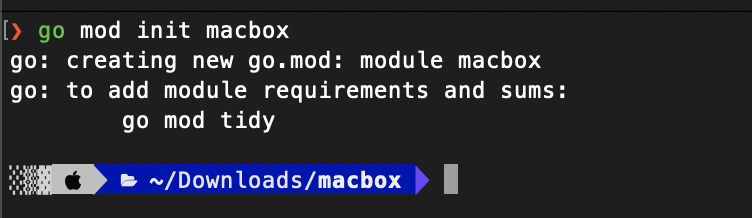
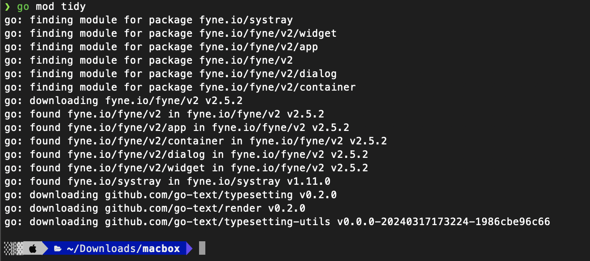
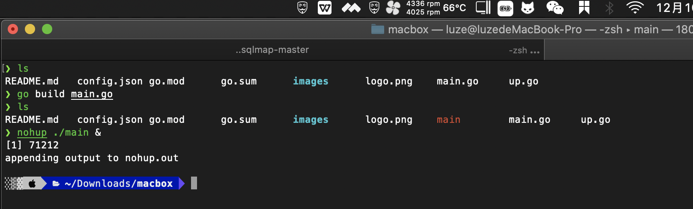
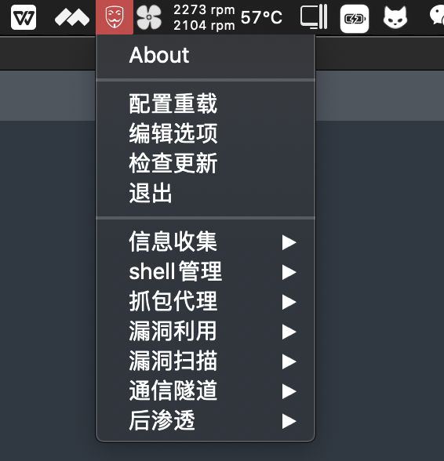
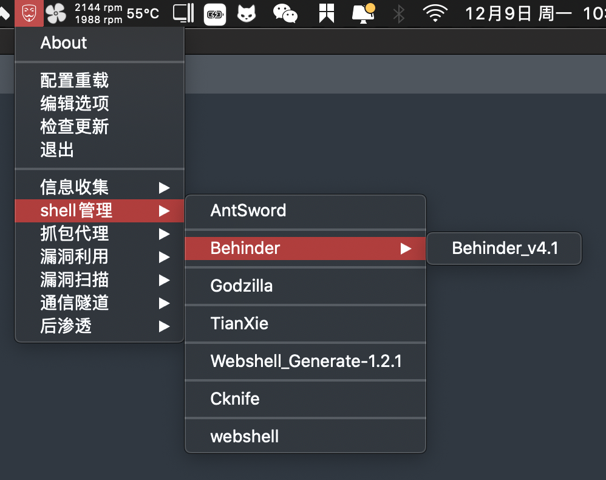
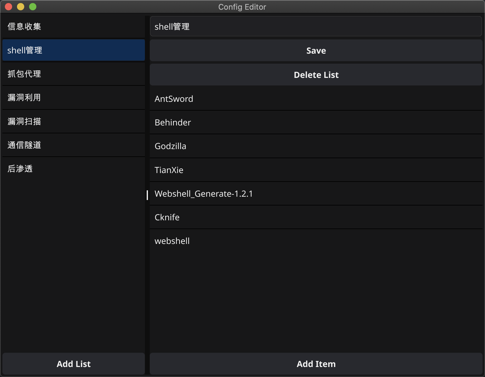

# macbox

  

     
           

 
 
     
    <a href="https://github.com/0x7eTeam/macbox/releases">下载程序</a>
    ·
    <a href="https://github.com/0x7eTeam/macbox/issues">反馈Bug|提交需求</a>

  

## 使用 

第一步，下载这个项目到本地，解压

第二步，将文件夹 macbox-main 重命名成macbox

第三步，初始化环境
`go init macbox`

第四步，下载依赖
`go mod tidy`

第五步，编译并执行
`go build main.go`

第六步，修改你的配置文件

  1、使用编辑器直接编辑config.json
  
  2、`go build up.go`  之后使用up工具去管理config.json

## 效果图1

## 效果图2

有建议和需求可提 ISSUE 
